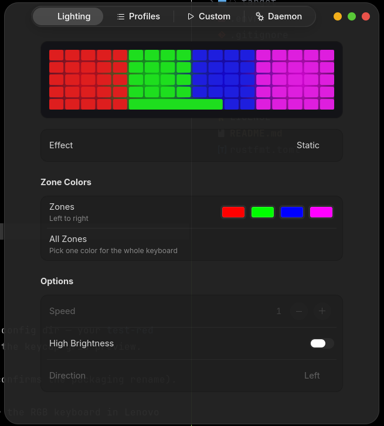
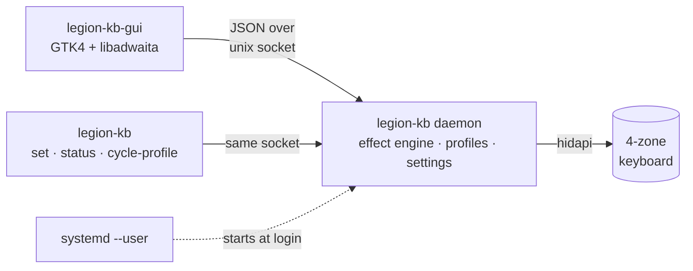

<div align="center">

# legion-kb

**A minimal daemon + native GTK4 app for the 4-zone RGB keyboard in Lenovo Legion laptops.**

A ground-up rearchitecture of [4JX/L5P-Keyboard-RGB](https://github.com/4JX/L5P-Keyboard-RGB), whose reverse-engineered driver and effect engine make this project possible.



</div>

## Why a rearchitecture

The original ships everything — driver, effect threads, tray icon, UI — in one egui process. Close the window and your lighting dies with it; on Wayland the window can't even hide to the tray ([#181](https://github.com/4JX/L5P-Keyboard-RGB/issues/181)). This fork splits the system at its natural seam:



|                   | upstream                             | this fork                                          |
| ----------------- | ------------------------------------ | -------------------------------------------------- |
| Lighting lifetime | dies with the window                 | daemon survives login to logout                    |
| Startup           | launch it yourself                   | systemd user service, profile restored at login    |
| UI                | egui, fixed 500×460 window           | native GTK4/libadwaita, GNOME HIG                  |
| CLI               | one-shot, hardware effects only      | talks to the daemon — software effects persist     |
| Settings          | `./settings.json` in the working dir | XDG config, atomic writes, migrates old files      |
| Keyboard unplug   | panics an effect thread              | detected, reacquired with backoff, shown in the UI |

The daemon owns everything stateful behind one command loop (one thread mutates state, everything else sends messages), channels and queues are bounded, and no driver call can panic the engine — written [TigerStyle](https://github.com/tigerbeetle/tigerbeetle/blob/main/docs/TIGER_STYLE.md), adapted to Rust.

## Install (NixOS + home-manager)

```nix
# flake inputs
legion-kb.url = "github:HughScott2002/legion-kb";

# home-manager: run the daemon at login
imports = [ legion-kb.homeModules.default ];
services.legion-kb-rgb.enable = true;

# nixos: let your user open the keyboard without root
imports = [ legion-kb.nixosModules.default ];
hardware.legion-kb-rgb.enable = true;
```

Or just try it: `nix run github:HughScott2002/legion-kb` (GUI) — `nix run github:HughScott2002/legion-kb#daemon` first if the service isn't running.

## CLI

```console
$ legion-kb status
daemon:   running (v0.21.0)
keyboard: connected
profile:  gaming — Static effect

$ legion-kb set -e Swipe -c 255,0,0,0,255,0,0,0,255,255,0,255 -s 3
profile applied        # keeps running after the CLI exits — it lives in the daemon

$ legion-kb cycle-profile   # bind this to a GNOME shortcut for Wayland-native switching
```

## Credits

- [4JX/L5P-Keyboard-RGB](https://github.com/4JX/L5P-Keyboard-RGB) — the original project: the USB HID driver, the effect implementations and years of device support live on here, GPL-3.0 like this fork.
- Supported models (2020–2024 Legion / IdeaPad / LOQ) are unchanged from upstream — see [`driver/src/lib.rs`](driver/src/lib.rs).
