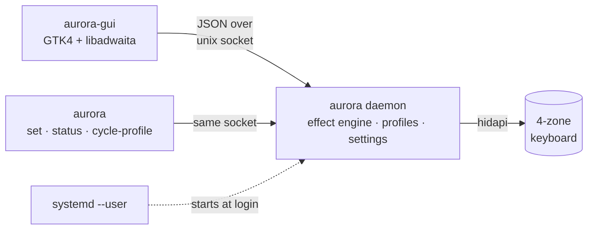

<div align="center">

# Aurora for Legion

**No Lenovo Vantage on Linux? The usual alternative keeps a window running to keep animated effects alive.**

Aurora runs them quietly in the background, restores your profile at login, and gives you a polished native app with more ways to control your keyboard.

<p>
  <a href="#install-on-nixos"></a>&nbsp;
  <a href="#cli"></a>&nbsp;
  <a href="#measured-not-claimed"></a>&nbsp;
  <a href="https://github.com/HughScott2002/Aurora-Legion/discussions"></a>
</p>

<p>
  
  
  
  
  
</p>

</div>

<!-- Add phone demo here: start an animated effect, close the GUI, show it continuing, reopen the GUI, then change it again. -->

<div align="center">
  
</div>

Set an animated effect, close the window, and keep the animation. Open Aurora later to change it again.

## Install on NixOS

NixOS and Home Manager get first-class modules. On any other distro, see [Install on other Linux](#install-on-other-linux) below.

Aurora supports 4-zone RGB keyboards across select 2020 to 2024 Legion, IdeaPad, and LOQ laptops. Check [`driver/src/lib.rs`](driver/src/lib.rs) for exact USB IDs.

```nix
# flake inputs
aurora.url = "github:HughScott2002/Aurora-Legion";

# home-manager: run the daemon at login
imports = [ aurora.homeModules.default ];
services.aurora.enable = true;

# nixos: let your user open the keyboard without root
imports = [ aurora.nixosModules.default ];
hardware.aurora.enable = true;
```

To try it without installing, start the daemon and then the GUI:

```console
$ nix run github:HughScott2002/Aurora-Legion#daemon &
$ nix run github:HughScott2002/Aurora-Legion
```

For keyboard permissions or building from a clone, see the [quick start](docs/quick-start.md).

## Install on other Linux

Download the latest `aurora-<version>-x86_64-linux-gnu.tar.gz` from the [releases page](https://github.com/HughScott2002/Aurora-Legion/releases), unpack it, and run `./install.sh`. It needs GTK 4.14 and libadwaita 1.5 or newer, so Ubuntu 24.04, Debian 13, Fedora 40+, and Arch all work. To build from source instead, follow the [Without nix guide](docs/quick-start.md#without-nix).

<details>
<summary><strong>Install with an AI assistant</strong> (paste this into Claude Code or any coding agent)</summary>

```text
Install Aurora (https://github.com/HughScott2002/Aurora-Legion) on this
machine and verify it works. Aurora is a keyboard RGB daemon, CLI, and
GTK4 app for Lenovo Legion, IdeaPad, and LOQ laptops with 4-zone RGB
keyboards.

Ground rules: ask me before running anything with sudo. Sudo is only
needed for distro packages and one udev rule. Outside my home
directory, only /etc/udev/rules.d/99-aurora.rules may be created.

1. Detect the environment: distro and version from /etc/os-release,
   architecture from uname -m (must be x86_64), and the keyboard from
   lsusb. The vendor id is 048d; supported product ids are c955 c963
   c965 c973 c975 c983 c984 c985 c993 c994 c995. If lsusb shows an
   048d device with a different product id, stop and help me open an
   "unsupported keyboard" issue on the repo with the lsusb line.

2. Pick an install path:
   - NixOS: follow the "Install on NixOS" section of the repo README
     instead of the steps below.
   - glibc 2.39+ and GTK 4.14+ available: download the latest
     aurora-*-x86_64-linux-gnu.tar.gz from the repo's GitHub releases,
     install the runtime packages listed in its README.txt for my
     distro, then run its install.sh (it installs into ~/.local and
     ~/.config/systemd/user, and asks about the udev rule).
   - Otherwise: build from source following the "Without nix" section
     of docs/quick-start.md in the repo.

3. Verify: after the udev rule is installed and the keyboard replugged,
   aurora status must report the daemon running and the keyboard
   connected. Launch aurora-gui and confirm the window opens.

4. If verification fails, debug in this order:
   - Keyboard "permission denied" or not connected: confirm
     /etc/udev/rules.d/99-aurora.rules exists, run
     sudo udevadm control --reload-rules && sudo udevadm trigger,
     replug the keyboard, and check the hidraw ACLs with getfacl.
   - Daemon not running: systemctl --user status aurora and
     journalctl --user -u aurora -e; the unit binds to
     graphical-session.target, so confirm that target is active. As a
     last resort run aurora daemon in the foreground and read stderr.
   - GUI fails to start: check for missing libraries with
     ldd ~/.local/bin/aurora-gui | grep "not found" and install the
     matching packages.

5. When done, summarize what was installed and where, and how to
   uninstall it (the file list is in the tarball's README.txt).
```

</details>

## Why Aurora

Lenovo Vantage does not run on Linux. [L5P-Keyboard-RGB](https://github.com/4JX/L5P-Keyboard-RGB) made control possible through its reverse-engineered driver and effect engine, but its UI, tray, and software effects share one process.

On Wayland, that process cannot hide to the tray ([#181](https://github.com/4JX/L5P-Keyboard-RGB/issues/181)). Close it and animated effects stop.

Aurora preserves the hardware work while moving profiles and effects into a persistent daemon.

| Capability        | L5P-Keyboard-RGB                      | Aurora                                             |
| ----------------- | ------------------------------------- | -------------------------------------------------- |
| Lighting lifetime | Animated effects need the app process | Animated effects continue after the GUI closes     |
| Startup           | Started manually                      | systemd user service, profile restored at login    |
| UI                | egui, fixed 500×460 window            | Native GTK4/libadwaita, GNOME HIG                  |
| CLI               | Separate one-shot process             | Talks to shared daemon state                       |
| Integration       | CLI and custom-effect JSON            | CLI, JSON IPC, systemd, and Home Manager modules   |
| Settings          | `./settings.json` in the working dir  | XDG config, atomic writes, migrates old files      |
| Keyboard unplug   | Can panic an effect thread            | Detected, reacquired with backoff, shown in the UI |

## Measured, not claimed

Same machine, same Nix pipeline, release builds. PSS and CPU were sampled twice over 60-second windows. [See the methodology and raw data](docs/measurements.md).

"Resident" compares each project's long-running control process: L5P-Keyboard-RGB's GUI and Aurora's daemon. Aurora's GUI uses about `61 MiB` but only while open.

| Metric                  | L5P-Keyboard-RGB 0.20.8  | Aurora                     | Verdict                             |
| ----------------------- | ------------------------ | -------------------------- | ----------------------------------- |
| Resident memory, Static | 82.6 MiB                 | 10.2 MiB                   | ✅ 8× smaller                       |
| Resident memory, Swipe  | 82.3 MiB                 | 10.8 MiB                   | ✅ 8× smaller                       |
| Resident CPU, idle      | 0.10%                    | 0.04%                      | ✅ 2.5× lower                       |
| Resident CPU, Swipe     | 0.52%                    | 0.55% to 0.97%             | ⚠️ comparable, more variance        |
| Binaries on disk        | 26.6 MB                  | 8.4 MB daemon + 2.5 MB GUI | ✅ 2.4× smaller combined            |
| GUI while open          | is the resident 82.6 MiB | 61 MiB, exits on close     | ✅ lighter, and transient by design |

## How it works

The daemon starts on its own at login. The GUI and CLI are clients, not the resident process.



The daemon owns state behind one command loop: one thread mutates state and everything else sends messages. Channels and queues are bounded, and driver failures cannot panic the engine.

The code follows [TigerStyle](https://github.com/tigerbeetle/tigerbeetle/blob/main/docs/TIGER_STYLE.md), adapted to Rust.

## CLI

```console
$ aurora status
daemon:   running (v0.21.0)
keyboard: connected
profile:  gaming (Static effect)

$ aurora set -e Swipe -c 255,0,0,0,255,0,0,0,255,255,0,255 -s 3
profile applied        # keeps running after the CLI exits; it lives in the daemon

$ aurora cycle-profile   # bind this to a GNOME shortcut for Wayland-native switching
```

## Community

Questions, ideas, and show-and-tell are welcome in [Discussions](https://github.com/HughScott2002/Aurora-Legion/discussions). Pull requests are welcome too.

Start with [CONTRIBUTING.md](CONTRIBUTING.md); code rules live in [docs/style-guide.md](docs/style-guide.md).

New frontends connect through the [`protocol`](protocol/) crate over JSON on a Unix socket. A TUI, KDE, or web client can be added without changing the daemon.

## Credits

- Aurora builds on [4JX/L5P-Keyboard-RGB](https://github.com/4JX/L5P-Keyboard-RGB). Its reverse-engineered USB HID driver, effects, and years of device support made this rearchitecture possible. Both projects are GPL-3.0.
