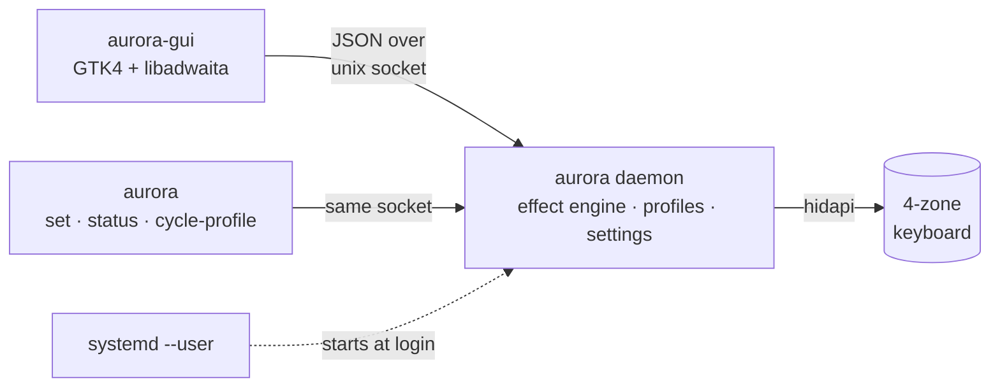

<div align="center">

# Aurora

**A minimal daemon + native GTK4 app for the 4-zone RGB keyboard in Lenovo Legion laptops.**

A ground-up rearchitecture of [4JX/L5P-Keyboard-RGB](https://github.com/4JX/L5P-Keyboard-RGB), whose reverse-engineered driver and effect engine make this project possible.

<p>
  <a href="#install-nixos--home-manager"></a>&nbsp;
  <a href="#cli"></a>&nbsp;
  <a href="#measured-not-claimed"></a>&nbsp;
  <a href="https://github.com/HughScott2002/aurora/discussions"></a>
</p>

<p>
  
  
  
  
  
  
</p>


</div>

## Why a rearchitecture

The original ships everything (driver, effect threads, tray icon, UI) in one egui process. Close the window and your lighting dies with it; on Wayland the window can't even hide to the tray ([#181](https://github.com/4JX/L5P-Keyboard-RGB/issues/181)). This fork splits the system at its natural seam:



|                   | L5P-Keyboard-RGB                        | Aurora                                               |
| ----------------- | --------------------------------------- | ------------------------------------------------------- |
| Lighting lifetime | ❌ dies with the window                 | ✅ daemon survives login to logout                      |
| Startup           | ❌ launch it yourself                   | ✅ systemd user service, profile restored at login      |
| UI                | ❌ egui, fixed 500×460 window           | ✅ native GTK4/libadwaita, GNOME HIG                    |
| CLI               | ❌ one-shot, hardware effects only      | ✅ talks to the daemon, so effects persist              |
| Scripting         | ❌ none                                 | ✅ JSON IPC socket, CLI, systemd + home-manager modules |
| Settings          | ❌ `./settings.json` in the working dir | ✅ XDG config, atomic writes, migrates old files        |
| Keyboard unplug   | ❌ panics an effect thread              | ✅ detected, reacquired with backoff, shown in the UI   |

The daemon owns everything stateful behind one command loop (one thread mutates state, everything else sends messages), channels and queues are bounded, and no driver call can panic the engine. Written [TigerStyle](https://github.com/tigerbeetle/tigerbeetle/blob/main/docs/TIGER_STYLE.md), adapted to Rust.

## Measured, not claimed

Same machine, same nix pipeline, release builds. PSS and CPU sampled over 60 s windows, two passes; [methodology and raw numbers here](docs/measurements.md). "Resident" means the process that must run for the lights to work at all: L5P-Keyboard-RGB's GUI window, Aurora's daemon.

| Metric                  | L5P-Keyboard-RGB 0.20.8  | Aurora                     | verdict                             |
| ----------------------- | ------------------------ | -------------------------- | ----------------------------------- |
| Resident memory, Static | 82.6 MiB                 | 10.2 MiB                   | ✅ 8× smaller                       |
| Resident memory, Swipe  | 82.3 MiB                 | 10.8 MiB                   | ✅ 8× smaller                       |
| Resident CPU, idle      | 0.10%                    | 0.04%                      | ✅ 2.5× lower                       |
| Resident CPU, Swipe     | 0.52%                    | 0.55–0.97%                 | ⚠️ comparable, more variance        |
| Binaries on disk        | 26.6 MB                  | 8.4 MB daemon + 2.5 MB GUI | ✅ 2.4× smaller combined            |
| GUI while open          | is the resident 82.6 MiB | 61 MiB, exits on close     | ✅ lighter, and transient by design |

## Install (NixOS + home-manager)

```nix
# flake inputs
aurora.url = "github:HughScott2002/aurora";

# home-manager: run the daemon at login
imports = [ aurora.homeModules.default ];
services.aurora.enable = true;

# nixos: let your user open the keyboard without root
imports = [ aurora.nixosModules.default ];
hardware.aurora.enable = true;
```

Or just try it: `nix run github:HughScott2002/aurora` (GUI); run `nix run github:HughScott2002/aurora#daemon` first if the service isn't running. Building from a clone: [docs/quick-start.md](docs/quick-start.md).

## CLI

```console
$ aurora status
daemon:   running (v0.21.0)
keyboard: connected
profile:  gaming (Static effect)

$ aurora set -e Swipe -c 255,0,0,0,255,0,0,0,255,255,0,255 -s 3
profile applied        # keeps running after the CLI exits; it lives in the daemon

$ aurora cycle-profile   # bind this to a GNOME shortcut for Wayland-native switching
```

## Community

[Discussions are open](https://github.com/HughScott2002/aurora/discussions); questions, ideas and show-and-tell all welcome. PRs too, especially new frontends: the [`protocol`](protocol/) crate is the seam (JSON over a unix socket), so a TUI, KDE or web client needs zero daemon changes. Start with [CONTRIBUTING.md](CONTRIBUTING.md); the code rules live in [docs/style-guide.md](docs/style-guide.md).

## Credits

- [4JX/L5P-Keyboard-RGB](https://github.com/4JX/L5P-Keyboard-RGB): the original project. The USB HID driver, the effect implementations and years of device support live on here, GPL-3.0 like this fork.
- Supported models (2020–2024 Legion / IdeaPad / LOQ) are unchanged from L5P-Keyboard-RGB; see [`driver/src/lib.rs`](driver/src/lib.rs).
