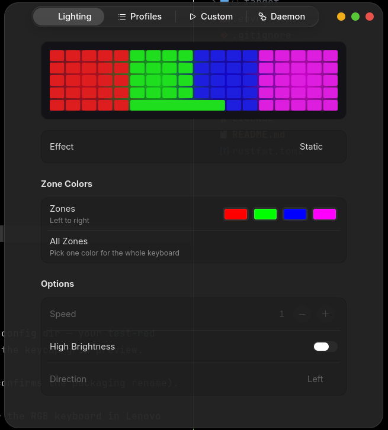
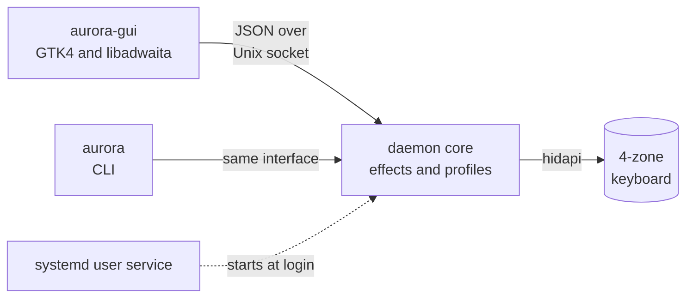

<div align="center">

**Linux Native Lenovo keyboard RGB. Tiny runtime more effects.**

<p>
  <a href="docs/quick-start.md"></a>&nbsp;
  <a href="docs/README.md"></a>&nbsp;
  <a href="https://github.com/HughScott2002/Aurora-Legion/discussions"></a>
</p>

<p>
  
  
  
  
</p>

</div>


https://github.com/user-attachments/assets/104b2c9e-340e-448c-b0f4-6f60c13d4f3a

<!-- <div align="center"> -->
  <!--  -->
  <!--  -->
<!-- </div> -->


Aurora controls 4-zone RGB keyboards in select Lenovo Legion, IdeaPad
and LOQ laptops. A small daemon owns the lighting. The native GTK app
and CLI can close without stopping it.

Aurora supports controllers from 2020 through 2024. See
[`driver/src/lib.rs`](driver/src/lib.rs) for exact USB IDs.

## Start

On NixOS, add the flake input and pick one of the two setups:

```nix
# flake inputs
aurora.url = "github:HughScott2002/Aurora-Legion";
```

**Without home-manager.** One option installs the package, the udev
rules, and the daemon as a systemd user service:

```nix
# nixos configuration
imports = [ aurora.nixosModules.default ];
services.aurora.enable = true;
```

**With home-manager.** Run the daemon per-user; the NixOS side only
grants keyboard access:

```nix
# home-manager: run the daemon at login
imports = [ aurora.homeModules.default ];
services.aurora.enable = true;

# nixos: let your user open the keyboard without root
imports = [ aurora.nixosModules.default ];
hardware.aurora.enable = true;
```

To try it without installing, start the daemon and then the GUI:

```console
$ nix run github:HughScott2002/Aurora-Legion#daemon &
$ nix run github:HughScott2002/Aurora-Legion
```

The [quick start](docs/quick-start.md) takes you from launch to a visible
profile. For NixOS, AppImage, tarball and source installs, use the
[documentation map](docs/README.md).

## Why Aurora

Lenovo Vantage does not run on Linux.
[L5P-Keyboard-RGB](https://github.com/4JX/L5P-Keyboard-RGB) made these
keyboards controllable, but its interface and software effects share
one process. Close that process and animated effects stop.

Aurora keeps profiles and effects in a persistent daemon.

| Capability | L5P-Keyboard-RGB 0.20.8 | Aurora |
| --- | --- | --- |
| Lighting lifetime | Animated effects need the app | Effects continue after the GUI closes |
| Fn+Space | Not detected; the key shows firmware lighting instead of yours | Detected; each slot keeps its own lighting |
| Slots per profile | One lighting configuration | Three, one per Fn+Space slot |
| Choosing a slot | The keyboard's own cycle only | Keyboard, app, or `aurora slot 2` |
| Startup | Manual | Profile restored by a user service |
| Interface | egui | Native GTK4 and libadwaita |
| CLI | Separate state | Shared daemon state |
| Other clients | None | Versioned JSON protocol on a unix socket |
| Unsupported machine | Fails quietly | Each optional feature reports its own state and reason |
| Settings | Working-directory JSON | XDG config, atomic writes, never erased on a read failure |
| Keyboard unplug | Can panic an effect thread | Reports failure and reacquires |

## Fn+Space keeps your lighting

The keyboard has three lighting slots of its own plus off, and Fn+Space
cycles them. The embedded controller owns them, applies its own stored
lighting on each press, and offers no command to set or select a slot.

Software that only writes to the keyboard never sees any of this. Press
the key and the firmware's lighting replaces yours; edit a colour and it
lands in whichever slot happens to be active. In practice you get one
usable slot out of three.

Aurora listens for the event the controller raises, and keeps a lighting
per slot:

```console
$ aurora slot 2
slot 2 selected
```

A profile holds all three. Save one profile and you have saved three
looks, reachable from the keyboard without opening anything.

The evidence behind this, including the approaches that do not work and
why polling the slot counter is one of them, is in
[Fn+Space synchronization](docs/explanation/fn-space-sync.md) and the
[hardware research](docs/research/ite8295-hardware-profiles.md).

## Measured

Both projects were built and measured on the same machine on the same
day, through the same Nix pipeline. The resident comparison uses
L5P-Keyboard-RGB's GUI and Aurora's daemon, because those are the
processes that have to stay alive for the lights to stay on. See the
[method and raw data](docs/measurements.md).

| Metric | L5P-Keyboard-RGB 0.20.8 | Aurora | Verdict |
| --- | --- | --- | --- |
| Resident memory, Static | 92.5 MiB | 11.5 MiB | ✅ 8× smaller |
| Resident memory, Swipe | 92.2 MiB | 11.5 MiB | ✅ 8× smaller |
| Resident CPU, idle | 0.13% | 0.05% | ✅ 2.6× lower |
| Resident CPU, Swipe | 0.52% | 0.50% | ➖ the same, it is the same code |
| Binaries on disk | 26.6 MB | 8.7 MB daemon and 2.7 MB GUI | ✅ 2.3× smaller combined |
| GUI while open | 92.5 MiB, always | 85.2 MiB, until you close it | ✅ lighter and transient |

Measured 2026-07-27. 

## How it works


```mermaid
graph LR
    GUI["aurora-gui<br/>GTK4 and libadwaita"] -- "JSON over<br/>Unix socket" --> D
    CLI["aurora<br/>CLI"] -- "same interface" --> D
    D["daemon core<br/>effects and profiles"] -- hidapi --> KB[("4-zone<br/>keyboard")]
    SD["systemd user service"] -. "starts at login" .-> D
```

The daemon core module alone mutates state. Other daemon modules send
bounded commands to its interface. The protocol crate defines the
UI-free client seam; the GUI and CLI are adapters at that seam.

Read [Architecture](docs/explanation/architecture.md) for the design or
[IPC protocol](docs/protocol.md) to build another client.

## Community

Use [Discussions](https://github.com/HughScott2002/Aurora-Legion/discussions)
for questions and ideas. Start contributions with
[CONTRIBUTING.md](CONTRIBUTING.md).

## Credits

Aurora builds on
[4JX/L5P-Keyboard-RGB](https://github.com/4JX/L5P-Keyboard-RGB). Its
reverse-engineered USB HID driver, effects and device support made
Aurora possible. Both projects use GPL-3.0.
