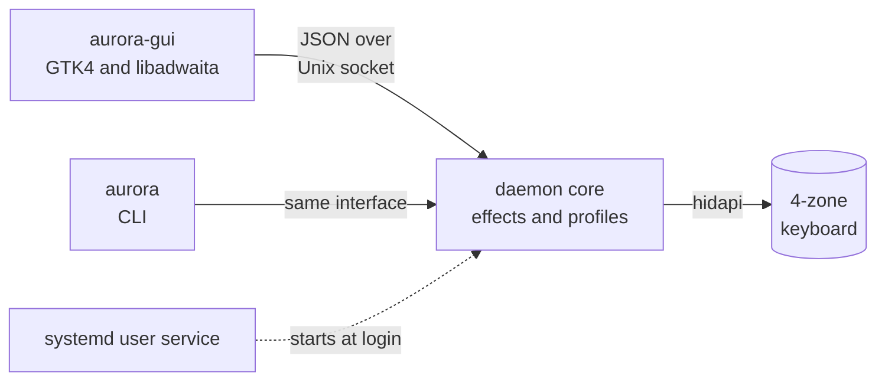

<div align="center">

**Keep Lenovo keyboard effects running after the window closes.**

<p>
  <a href="docs/quick-start.md"></a>&nbsp;
  <a href="docs/README.md"></a>&nbsp;
  <a href="https://github.com/HughScott2002/Aurora-Legion/discussions"></a>
</p>

<p>
  
  
  
  
</p>

</div>

<div align="center">
  
</div>

Aurora controls 4-zone RGB keyboards in select Lenovo Legion, IdeaPad
and LOQ laptops. A small daemon owns the lighting. The native GTK app
and CLI can close without stopping it.

Aurora supports controllers from 2020 through 2024. See
[`driver/src/lib.rs`](driver/src/lib.rs) for exact USB IDs.

## Start

With Nix:

```console
$ nix run github:HughScott2002/Aurora-Legion#daemon &
$ nix run github:HughScott2002/Aurora-Legion
```

The [quick start](docs/quick-start.md) takes you from launch to a visible
profile. For NixOS, AppImage, tarball and source installs, use the
[documentation map](docs/README.md).

## Why Aurora

Lenovo Vantage does not run on Linux.
[L5P-Keyboard-RGB](https://github.com/4JX/L5P-Keyboard-RGB) made these
keyboards controllable, but its interface and software effects share
one process. Close that process and animated effects stop.

Aurora keeps profiles and effects in a persistent daemon.

| Capability | L5P-Keyboard-RGB | Aurora |
| --- | --- | --- |
| Lighting lifetime | Animated effects need the app | Effects continue after the GUI closes |
| Startup | Manual | Profile restored by a user service |
| Interface | egui | Native GTK4 and libadwaita |
| CLI | Separate state | Shared daemon state |
| Settings | Working-directory JSON | XDG config with atomic writes |
| Keyboard unplug | Can panic an effect thread | Reports failure and reacquires |

## Measured

The same machine and Nix release pipeline measured both projects. The
resident comparison uses L5P-Keyboard-RGB's GUI and Aurora's daemon.
See the [method and raw data](docs/measurements.md).

| Metric | L5P-Keyboard-RGB 0.20.8 | Aurora | Verdict |
| --- | --- | --- | --- |
| Resident memory, Static | 82.6 MiB | 10.2 MiB | ✅ 8× smaller |
| Resident memory, Swipe | 82.3 MiB | 10.8 MiB | ✅ 8× smaller |
| Resident CPU, idle | 0.10% | 0.04% | ✅ 2.5× lower |
| Resident CPU, Swipe | 0.52% | 0.55% to 0.97% | ⚠️ comparable, more variance |
| Binaries on disk | 26.6 MB | 8.4 MB daemon and 2.5 MB GUI | ✅ 2.4× smaller combined |
| GUI while open | 82.6 MiB resident | 61 MiB until closed | ✅ lighter and transient |

## How it works


```mermaid
graph LR
    GUI["aurora-gui<br/>GTK4 and libadwaita"] -- "JSON over<br/>Unix socket" --> D
    CLI["aurora<br/>CLI"] -- "same interface" --> D
    D["daemon core<br/>effects and profiles"] -- hidapi --> KB[("4-zone<br/>keyboard")]
    SD["systemd user service"] -. "starts at login" .-> D
```

The daemon core module alone mutates state. Other daemon modules send
bounded commands to its interface. The protocol crate defines the
UI-free client seam; the GUI and CLI are adapters at that seam.

Read [Architecture](docs/explanation/architecture.md) for the design or
[IPC protocol](docs/protocol.md) to build another client.

## Community

Use [Discussions](https://github.com/HughScott2002/Aurora-Legion/discussions)
for questions and ideas. Start contributions with
[CONTRIBUTING.md](CONTRIBUTING.md).

## Credits

Aurora builds on
[4JX/L5P-Keyboard-RGB](https://github.com/4JX/L5P-Keyboard-RGB). Its
reverse-engineered USB HID driver, effects and device support made
Aurora possible. Both projects use GPL-3.0.
