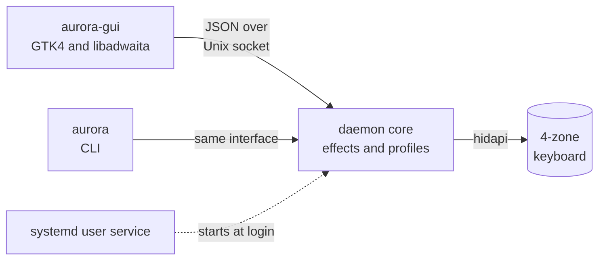

<div align="center">

**Beautiful Linux Native RGB controls for Legion**

<p>
  <a href="docs/quick-start.md"></a>&nbsp;
  <a href="docs/README.md"></a>&nbsp;
  <a href="https://github.com/HughScott2002/Aurora-Legion/discussions"></a>
</p>

<p>
  
  
  
  
</p>

</div>

https://github.com/user-attachments/assets/104b2c9e-340e-448c-b0f4-6f60c13d4f3a

<p align="center">
  Aurora gives Legion users on Linux a native app to control every lighting slot
  and choose from a wider range of effects.<br />
  Your lighting stays alive after you close the app, using fewer resources in the background.
</p>

<p align="center">
  
  
  
</p>

<p align="center">
  Supports select 4-zone RGB keyboards in Lenovo Legion, IdeaPad and LOQ laptops
  from 2020 through 2024.
  <a href="driver/src/lib.rs">Check the exact USB IDs.</a>
</p>

<p align="center">
  <em>Aurora would not exist without
  <a href="https://github.com/4JX/L5P-Keyboard-RGB">L5P-Keyboard-RGB</a>, whose
  hardware research, driver and effects laid the foundation.</em>
</p>

<br />

## Why Aurora

On Linux, Legion lighting can mean limited slots, an app that has to
stay open, or firmware colours returning when you press Fn+Space.
Aurora fixes those rough edges.

### Three slots. Three looks.

Each profile saves a different look for all three Fn+Space slots. Cycle
them from the keyboard or choose one in the app.

<br />

### Close the app. Keep the lighting.

Your profile and animated effects keep running after the window closes.

<br />

### Small in the background.

With static lighting, Aurora's daemon used about one-eighth the memory
of L5P-Keyboard-RGB's resident app in same-day tests.

<br />

<details>
<summary><strong>See the side-by-side comparison</strong></summary>

<br />

| What matters         | L5P-Keyboard-RGB 0.20.8      | Aurora                              |
| -------------------- | ---------------------------- | ----------------------------------- |
| After the app closes | Animated effects stop        | Profiles and effects keep running   |
| Fn+Space slots       | Firmware lighting takes over | All three slots keep your lighting  |
| Choosing a slot      | Keyboard cycle only          | Keyboard, app, or CLI               |
| Startup              | Manual                       | Last profile restored by a service  |
| Interface            | egui                         | Native GTK4 and libadwaita          |
| Static memory        | 92.5 MiB                     | 11.5 MiB                            |

</details>

---

## Install Aurora

> [!CAUTION]
> Aurora is open source and provided without warranty. Check that your
> device is supported, inspect the code if you wish, and use it at your
> own risk.

Choose the path that matches your system:

<p align="center">
  <a href="docs/how-to/install-nixos.md"></a>
  <a href="docs/how-to/install-linux.md"></a>
  <br />
  <a href="docs/how-to/build-from-source.md"></a>
  <a href="docs/install-with-ai.md"></a>
</p>

<br />

<details>
<summary><strong>Copy the coding-agent prompt</strong></summary>

<br />

```text
Install Aurora on this computer by following
https://raw.githubusercontent.com/HughScott2002/Aurora-Legion/main/docs/install-with-ai.md
Inspect my system first, choose one supported installation method, verify
the daemon and keyboard connection, then tell me what changed and how to
uninstall it.
```

</details>

---

## For the curious

<details>
<summary><strong>Performance measurements</strong></summary>

<br />

Both projects were built and measured on the same machine on the same
day through the same Nix pipeline. The resident comparison uses
L5P-Keyboard-RGB's GUI and Aurora's daemon because those are the
processes that must stay alive for animated lighting.

| Metric                  | L5P-Keyboard-RGB 0.20.8 | Aurora                       |
| ----------------------- | ----------------------- | ---------------------------- |
| Resident memory, Static | 92.5 MiB                | 11.5 MiB                     |
| Resident memory, Swipe  | 92.2 MiB                | 11.5 MiB                     |
| Resident CPU, idle      | 0.13%                   | 0.05%                        |
| Resident CPU, Swipe     | 0.52%                   | 0.50%                        |
| Binaries on disk        | 26.6 MB                 | 8.7 MB daemon and 2.7 MB GUI |
| GUI while open          | 92.5 MiB                | 85.2 MiB                     |

Measured 2026-07-27. Read the [method and raw data](docs/measurements.md)
for the full context.

</details>

<br />

<details>
<summary><strong>How Aurora works</strong></summary>

<br />


```mermaid
graph LR
    GUI["aurora-gui<br/>GTK4 and libadwaita"] -- "JSON over<br/>Unix socket" --> D
    CLI["aurora<br/>CLI"] -- "same interface" --> D
    D["daemon core<br/>effects and profiles"] -- hidapi --> KB[("4-zone<br/>keyboard")]
    SD["systemd user service"] -. "starts at login" .-> D
```

The daemon owns the lighting, profiles and effects. The GUI and CLI send
it commands, so they can close without taking your lighting with them.

Read [Architecture](docs/explanation/architecture.md) for the design or
[IPC protocol](docs/protocol.md) to build another client. The deeper
Fn+Space details live in [Fn+Space synchronization](docs/explanation/fn-space-sync.md)
and the [hardware research](docs/research/ite8295-hardware-profiles.md).

</details>

---

## Community

Use [Discussions](https://github.com/HughScott2002/Aurora-Legion/discussions)
for questions and ideas. Start contributions with
[CONTRIBUTING.md](CONTRIBUTING.md).

## Credits

Aurora builds on
[4JX/L5P-Keyboard-RGB](https://github.com/4JX/L5P-Keyboard-RGB). Its
reverse-engineered USB HID driver, effects and device support made
Aurora possible. Both projects use GPL-3.0.
