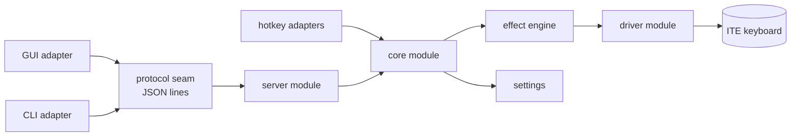

# Architecture

Aurora separates lighting from its controls. The daemon persists. The
GUI and CLI come and go.

That split solves the main Linux failure mode: a software effect should
not stop because its window closed.

## Flow

The protocol crate defines the client interface. It contains schema,
not GTK or file IO. The GUI and CLI are adapters at that seam.

Inside the daemon, every source sends commands to one bounded queue.
The core module consumes them on the main thread.

## One state owner

The core module alone mutates daemon state. It owns:

- the current profile;
- saved profiles and custom effects;
- keyboard status;
- the active Fn+Space slot;
- settings persistence;
- subscriber snapshots.

Server threads, signal handlers, hotkey listeners and the Fn+Space
listener send commands. They never edit state in place.

This makes the core module deep. Callers learn one command interface,
while ordering, persistence and broadcasts stay behind it. That depth
creates leverage for callers and locality for maintainers. A state bug
has one place to live.

## Effect engine and driver

The effect engine owns the active keyboard handle and effect worker.
The core tells it which profile to run. Hardware effects need one
feature report. Software effects keep producing frames until replaced
or stopped.

The driver module owns controller-specific HID implementation. It
validates payload fields and surfaces device errors. A failed write
causes keyboard reacquisition instead of a daemon panic.

The ITE controller permits one open HID owner. Slot readback shares the
driver's handle rather than opening a second handle.

## Clients

The GUI renders full state snapshots and sends requests. The CLI does
the same for one command at a time. Neither reads the settings file.

This rule matters. If clients wrote settings directly, the daemon could
hold different state from disk, and two clients could overwrite each
other. The protocol seam keeps one source of truth.

## Bounded failure

Aurora bounds command queues, subscriber queues, protocol lines,
retries and custom-effect steps. A slow client is disconnected before
it can stall the core. A dead keyboard becomes protocol-visible state.

The daemon can therefore keep serving healthy clients while it waits
to reacquire hardware.

## Related reference

- [IPC protocol](../protocol.md)
- [Runtime files and limits](../reference/runtime-files.md)
- [Code style and invariants](../style-guide.md)
- [Fn+Space synchronization](fn-space-sync.md)
